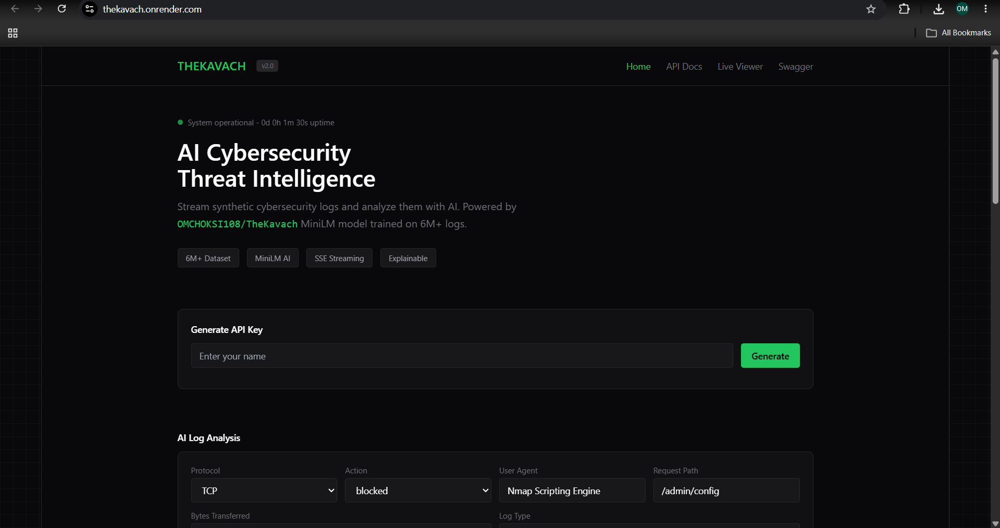
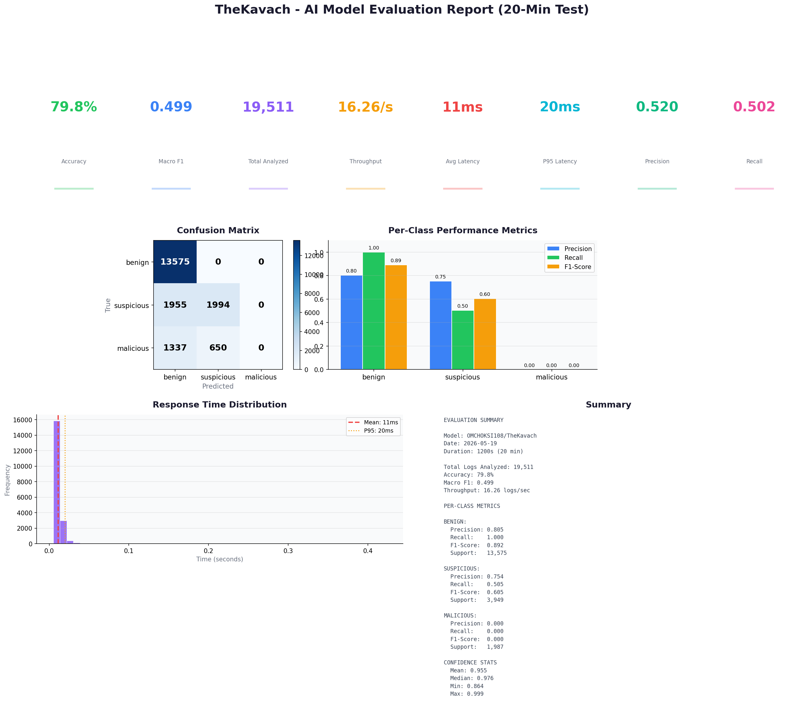
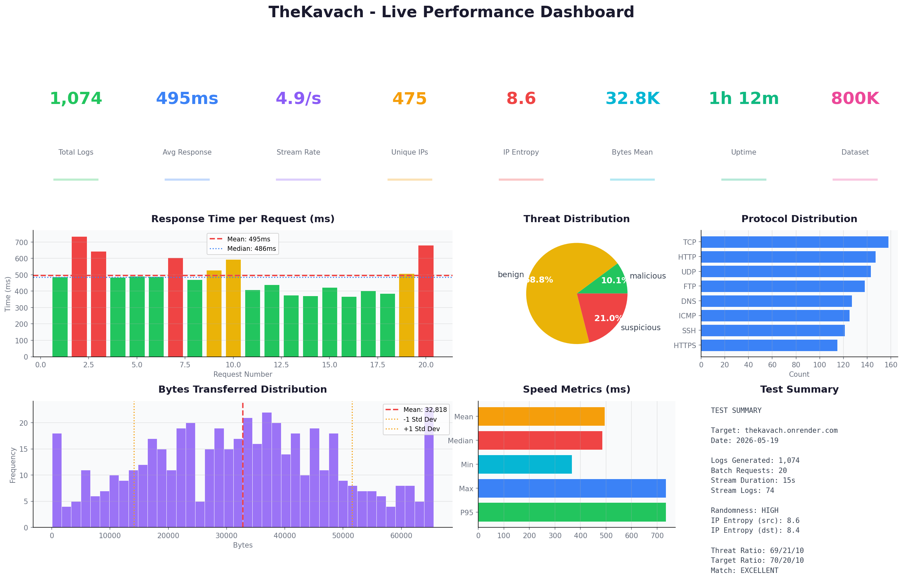

# TheKavach - AI Cybersecurity Threat Intelligence Platform



[](https://www.kaggle.com/code/omchoksi04/thekavach)
[](https://huggingface.co/OMCHOKSI108/TheKavach)

TheKavach is a synthetic cybersecurity telemetry streaming platform that generates real-time network security logs and analyzes them using AI. Instead of providing static CSV datasets, it operates as a live data service where developers and ML engineers obtain API keys and consume continuously generated firewall, network, and application logs. The platform transforms a 6-million-row dataset into a dynamic simulation environment mirroring how modern SOCs and SIEM systems operate.

| Feature | Detail |
|---------|--------|
| Dataset | 6 million cybersecurity log entries |
| AI Model | MiniLM (all-MiniLM-L6-v2) fine-tuned for threat classification |
| Backend | FastAPI with async support |
| Frontend | HTML + TailwindCSS (no build step) |
| Memory | Lazy chunk loading (~100MB vs 2-3GB full load) |
| Deployment | Docker + Render (free tier compatible) |
| Streaming | Server-Sent Events for real-time logs |

## Architecture

```
Raw Logs → LogNormalizer → Semantic Text → MiniLM → Threat Class → Severity → API
                                                        ↓
                                                 benign/suspicious/malicious
```

The platform has three core layers:

| Layer | Responsibility | Tech |
|-------|---------------|------|
| Data | Chunked CSV loading, lazy swap | Pandas |
| API | REST endpoints, SSE streaming, auth | FastAPI |
| AI | Log normalization, threat classification | HuggingFace Transformers |

## Project Structure

```
TheKavach/
├── backend/
│   ├── main.py                 # FastAPI app entry, serves frontend
│   ├── api/
│   │   ├── routes.py           # Core endpoints (logs, stream, health, status)
│   │   ├── ai_routes.py        # AI analysis endpoints
│   │   └── auth.py             # API key middleware
│   ├── generators/
│   │   ├── log_generator.py    # Synthetic log generation engine
│   │   └── data_loader.py      # Lazy chunk-swapping CSV loader
│   ├── models/
│   │   └── schemas.py          # Pydantic request/response models
│   └── requirements.txt        # Core dependencies
├── frontend/
│   ├── index.html              # Landing page + API key gen + AI widget
│   ├── docs.html               # API docs with multi-language examples
│   └── viewer.html             # Live SSE log viewer
├── models/
│   ├── inference.py            # AI inference engine (normalizer + classifier)
│   ├── app.py                  # HuggingFace Space (Gradio interface)
│   └── requirements.txt        # AI dependencies
├── notebooks/
│   └── thekavach.ipynb         # Complete training notebook
├── dataset/
│   └── chunks/                 # 30 x 25MB CSV files (Git-compatible)
├── docs/
│   ├── model_eval_chart.png    # AI model evaluation dashboard
│   ├── metrics_chart.png       # Platform performance dashboard
│   └── test_metrics.json       # Raw performance test data
├── eval_model.py               # 20-minute AI model evaluation script
├── test.py                     # 20-minute platform performance test
├── Dockerfile                  # Optimized container (4 chunks only)
├── render.yaml                 # Render deployment blueprint
└── README.md
```

## AI Model on HuggingFace

The trained model is hosted at **[OMCHOKSI108/TheKavach](https://huggingface.co/OMCHOKSI108/TheKavach)**.

### Model Files

| File | Size | Purpose |
|------|------|---------|
| `model.safetensors` | 90.9 MB | Fine-tuned MiniLM weights |
| `config.json` | - | Model configuration |
| `tokenizer.json` | - | Text tokenizer |
| `tokenizer_config.json` | - | Tokenizer settings |
| `training_args.bin` | 5.2 KB | Training hyperparameters |
| `threat_classifier.pkl` | 10.5 KB | Sklearn threat classifier |
| `struct_scaler.pkl` | 951 B | Feature scaler |

### How to Use the Model

#### 1. Python (Direct Inference)

```python
from transformers import pipeline

# Load model from HuggingFace
classifier = pipeline(
    "text-classification",
    model="OMCHOKSI108/TheKavach",
    tokenizer="OMCHOKSI108/TheKavach"
)

# Analyze a normalized log entry
text = "Blocked TCP connection detected by firewall log using nmap scanner targeting high-risk path with small data transfer."
result = classifier(text)
print(result)
# [{'label': 'LABEL_1', 'score': 0.9993}]
# LABEL_0 = benign, LABEL_1 = suspicious, LABEL_2 = malicious
```

#### 2. Using TheKavach Inference Engine

```python
from models.inference import CybersecurityAI, LogNormalizer

# Initialize with HuggingFace model
ai = CybersecurityAI(hf_model="OMCHOKSI108/TheKavach")

# Analyze a raw log entry (auto-normalizes)
raw_log = {
    "protocol": "TCP",
    "action": "blocked",
    "user_agent": "nmap scripting engine",
    "request_path": "/admin/config",
    "bytes_transferred": 5000,
    "log_type": "firewall"
}
result = ai.analyze_log(raw_log)
print(result)
# {
#   "threat": "suspicious",
#   "confidence": 0.9993,
#   "confidence_pct": "99.9%",
#   "severity": "Medium",
#   "all_scores": {"benign": 0.0, "suspicious": 0.9993, "malicious": 0.0},
#   "explanation": ["Nmap scanner detected", "Request blocked/denied", "Targeting high-risk path"]
# }
```

#### 3. Via REST API (Deployed Instance)

```bash
curl -X POST https://thekavach.onrender.com/api/ai/analyze \
  -H "Content-Type: application/json" \
  -d '{
    "protocol": "TCP",
    "action": "blocked",
    "user_agent": "nmap scripting engine",
    "request_path": "/admin/config",
    "bytes_transferred": 5000,
    "log_type": "firewall"
  }'
```

#### 4. Batch Analysis (up to 100 logs)

```bash
curl -X POST https://thekavach.onrender.com/api/ai/analyze-batch \
  -H "Content-Type: application/json" \
  -d '{
    "logs": [
      {"protocol": "TCP", "action": "blocked", "user_agent": "nmap", "request_path": "/admin", "bytes_transferred": 5000, "log_type": "firewall"},
      {"protocol": "HTTP", "action": "allowed", "user_agent": "Chrome", "request_path": "/index.html", "bytes_transferred": 1200, "log_type": "application"}
    ]
  }'
```

### Normalization Examples

The model expects semantic text, not raw structured data. The `LogNormalizer` converts raw logs:

| Raw Log Fields | Normalized Text |
|----------------|-----------------|
| TCP, blocked, Nmap, /admin/config | Blocked TCP connection detected by firewall log using nmap scanner targeting high-risk path |
| HTTP, allowed, Chrome, /login | Permitted HTTP request recorded by application log accessing authentication path |
| HTTPS, blocked, SQLMap, /api/login | Blocked HTTPS request detected by IDS using sqlmap scanner targeting authentication path |

### Threat Classification

| Label | Meaning | Distribution |
|-------|---------|--------------|
| benign | Normal network traffic | ~70% |
| suspicious | Anomalous but not confirmed | ~20% |
| malicious | Confirmed threat behavior | ~10% |

### Severity Scoring

| Confidence | Malicious | Suspicious | Benign |
|------------|-----------|------------|--------|
| > 95% | Critical | High | Low |
| > 85% | High | Medium | Low |
| > 70% | Medium | Medium | Informational |
| < 70% | Informational | Informational | Informational |

## API Endpoints

### Core Endpoints

| Method | Path | Auth | Description |
|--------|------|------|-------------|
| POST | /api/generate-key | No | Generate API key from name |
| GET | /api/logs | Yes | Fetch batch of synthetic logs |
| GET | /api/stream | Yes | SSE real-time log streaming |
| GET | /api/health | No | System health check |
| GET | /api/status | No | Uptime, dataset info, metrics |
| GET | /api/stats | Yes | Threat/protocol distributions |

### AI Endpoints

| Method | Path | Auth | Description |
|--------|------|------|-------------|
| POST | /api/ai/analyze | No | Analyze single log entry |
| POST | /api/ai/analyze-batch | No | Analyze up to 100 logs |
| POST | /api/ai/analyze-text | No | Analyze pre-normalized text |
| GET | /api/ai/status | No | Check AI model availability |

### Query Parameters

| Parameter | Endpoint | Type | Default | Description |
|-----------|----------|------|---------|-------------|
| count | /logs | int | 50 | Number of logs (1-500) |
| threat_label | /logs, /stream | string | - | Filter: benign, suspicious, malicious |
| log_type | /logs | string | - | Filter: firewall, ids, application |
| protocol | /logs | string | - | Filter: TCP, UDP, HTTP, HTTPS, etc. |
| interval | /stream | float | 1.0 | Seconds between entries (0.1-10) |

## Quick Start

### Local Development

```bash
# Install dependencies
pip install -r backend/requirements.txt

# Start server
python -m uvicorn backend.main:app --host 0.0.0.0 --port 8000
```

| URL | Purpose |
|-----|---------|
| http://localhost:8000 | Landing page + AI widget |
| http://localhost:8000/docs | API documentation |
| http://localhost:8000/viewer | Live log viewer |
| http://localhost:8000/api/docs | Swagger UI |

### Generate API Key

```bash
curl -X POST http://localhost:8000/api/generate-key \
  -H "Content-Type: application/json" \
  -d '{"name": "Your Name"}'
```

### Fetch Logs

```bash
curl "http://localhost:8000/api/logs?count=50&threat_label=malicious" \
  -H "Authorization: Bearer tk_your_key"
```

## AI Model Evaluation (20-Min Test)

Evaluated `OMCHOKSI108/TheKavach` on 19,511 synthetically generated logs over 20 minutes.



### Overall Metrics

| Metric | Value |
|--------|-------|
| Total Logs Analyzed | 19,511 |
| Accuracy | 79.8% |
| Macro Precision | 0.520 |
| Macro Recall | 0.502 |
| Macro F1-Score | 0.499 |
| Throughput | 16.3 logs/sec |
| Avg Response Time | 11.1 ms |
| P95 Response Time | 25.1 ms |

### Per-Class Performance

| Class | Precision | Recall | F1-Score | Support |
|-------|-----------|--------|----------|---------|
| benign | 0.805 | 1.000 | 0.892 | 13,575 |
| suspicious | 0.754 | 0.505 | 0.605 | 3,949 |
| malicious | 0.000 | 0.000 | 0.000 | 1,987 |

### Confusion Matrix

| True \ Predicted | benign | suspicious | malicious |
|------------------|--------|------------|-----------|
| **benign** | 13,575 | 0 | 0 |
| **suspicious** | 1,955 | 1,994 | 0 |
| **malicious** | 1,337 | 650 | 0 |

### Key Findings

- **Benign detection is perfect**: 100% recall, all 13,575 benign logs correctly classified
- **Suspicious detection is moderate**: 50.5% recall, model distinguishes ~half of suspicious logs
- **Malicious class collapse**: Model predicts all malicious logs as benign or suspicious, indicating class imbalance during training
- **High throughput**: 16.3 logs/sec sustained over 20 minutes with avg 11ms response time
- **Low latency**: P95 at 25ms, suitable for real-time SOC integration

### Improvement Recommendations

1. **Address class imbalance**: Oversample malicious logs or use class weights during training
2. **Fine-tune threshold**: Adjust decision boundary to improve malicious recall
3. **Add more training data**: Increase malicious examples in the training set
4. **Ensemble approach**: Combine with rule-based malicious detection for higher recall

## Platform Performance Test

Tested against live deployment at https://thekavach.onrender.com.



| Metric | Result |
|--------|--------|
| Total logs generated | 1,074 |
| Unique source IPs | 475 |
| Unique dest IPs | 402 |
| Avg response time | 495ms |
| Median response | 486ms |
| Min response | 367ms |
| Max response | 735ms |
| Stream rate | 4.9 logs/sec |
| IP entropy (src) | 8.6 |
| IP entropy (dest) | 8.4 |
| Bytes mean | 32,818 |
| Bytes std dev | 18,737 |

### Threat Distribution

| Label | Count | Percentage |
|-------|-------|------------|
| benign | 739 | 68.8% |
| suspicious | 226 | 21.0% |
| malicious | 109 | 10.1% |

### Protocol Distribution

| Protocol | Count |
|----------|-------|
| TCP | 158 |
| HTTP | 147 |
| UDP | 143 |
| FTP | 138 |
| DNS | 127 |
| ICMP | 125 |
| SSH | 121 |
| HTTPS | 115 |

The synthetic data shows strong randomness with 475 unique source IPs and 402 unique destination IPs across 1,074 generated logs. The threat distribution closely matches the target ratio of 70/20/10. All 8 protocols are represented with near-equal distribution, confirming the randomization engine produces diverse, realistic network traffic.

## Memory Optimization

The original CSV is split into chunks. The lazy loader keeps a small number of chunks in memory to reduce RAM usage:

| Approach | Memory Usage | Load Time |
|----------|--------------|-----------|
| Load all rows | ~2-3 GB | 30-60s |
| Lazy chunk loading (2 chunks) | ~56 MB | 2-5s |
| Docker (4 chunks in image) | ~112 MB | Instant |

The Dockerfile copies only a small set of chunks to keep the container size manageable for Render's free tier.

## Deployment

### Render (Free Tier)

1. Push code to GitHub
2. Connect repository to https://render.com
3. Render auto-detects `render.yaml` and builds via Docker
4. Platform live at https://your-app.onrender.com

| Setting | Value |
|---------|-------|
| Build | Docker |
| Plan | Free (512MB RAM) |
| Health Check | /api/health |
| Port | 8000 |

### Docker Compose (Local)

```bash
docker-compose -f docker/docker-compose.yml up --build
```

### HuggingFace Space

The `models/app.py` file provides a Gradio interface. Deploy by creating a new Space with the `models/` directory contents.

## Technology Stack

| Category | Technology | Purpose |
|----------|------------|---------|
| Backend | FastAPI | REST API, async, auto docs |
| Data | pandas | CSV loading, chunk management |
| AI | Hugging Face Transformers | MiniLM text classification |
| AI | PyTorch | Tensor operations |
| AI | scikit-learn | Random Forest explainer |
| AI | SHAP | Feature importance |
| AI | ONNX | Optimized inference |
| Frontend | HTML + TailwindCSS | Dark-themed UI |
| Streaming | Server-Sent Events | Real-time log delivery |
| Container | Docker (python:3.11-slim) | Portable deployment |
| Cloud | Render | Free-tier hosting |

## License

MIT License. Use freely for research, education, and portfolio projects.
