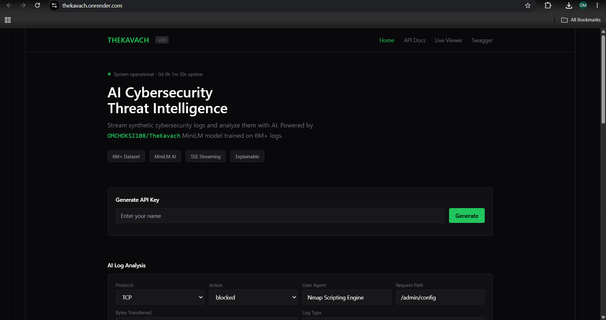

# TheKavach — AI Cybersecurity Threat Intelligence Platform



[](https://www.kaggle.com/code/omchoksi04/thekavach)
[](https://huggingface.co/OMCHOKSI108/TheKavach)


---

## What is TheKavach?

TheKavach is a real-time cybersecurity telemetry platform with AI-powered threat detection. It generates synthetic network security logs, streams them via Server-Sent Events, and classifies threats using a **hybrid ML + rule-based inference engine**. Built with FastAPI and HuggingFace MiniLM, it simulates a live SOC-like environment for developers, security researchers, and portfolio demonstration.

## Why Hybrid Detection?

The underlying MiniLM model achieves strong benign classification (100% recall) but struggles with malicious-class detection due to training class imbalance — a common production problem. **Instead of retraining for hours**, TheKavach uses a hybrid inference layer that combines:

- **ML model predictions** (confidence, all-class scores)
- **60+ rule-based heuristics** (SQL injection, XSS, command injection, path traversal, scanning, brute force, malware, suspicious network)
- **Configurable confidence thresholds** for override decisions
- **Transparent explanations** for every classification

This approach improves practical malicious detection without requiring expensive GPU retraining.

## Architecture

```
Client / Dashboard
    ↓
FastAPI API Layer
    ↓
Log Generator / AI Analyze Endpoint
    ↓
Log Normalizer
    ↓
MiniLM Model Inference  →  Rule-Based Security Heuristics
    ↓                              ↓
          Hybrid Decision Engine
                ↓
         Risk Score + Explanation
                ↓
         API Response / Dashboard
```

See [docs/architecture.md](docs/architecture.md) for detailed Mermaid diagrams.

## Features

| Feature | Description |
|---------|-------------|
| 🧠 **Hybrid Threat Detection** | ML + rule-based inference with transparent explanations |
| 📊 **Risk Scoring** | 0-100 risk score with security recommendations |
| ⚙️ **Configurable Thresholds** | Environment-driven override thresholds |
| 🔬 **Explainable AI** | Every prediction includes why the label was chosen |
| 📡 **SSE Streaming** | Real-time log delivery via Server-Sent Events |
| 🔑 **API Key Auth** | Simple key-based access control |
| 🐳 **Docker + Render** | Deploy anywhere with minimal config |
| 📦 **6M+ Row Dataset** | Lazy-chunked CSV loading (~100MB RAM) |

## API Endpoints

| Method | Path | Description |
|--------|------|-------------|
| POST | `/api/ai/analyze` | Analyze a single log entry with hybrid detection |
| POST | `/api/ai/analyze-batch` | Batch analyze up to 100 logs |
| POST | `/api/ai/analyze-text` | Analyze pre-normalized text |
| GET | `/api/ai/status` | AI model and hybrid detector status |
| POST | `/api/generate-key` | Generate API key |
| GET | `/api/logs` | Fetch synthetic logs |
| GET | `/api/stream` | SSE real-time log stream |
| GET | `/api/health` | System health check |

## API Response Example

**Request:**
```bash
curl -X POST http://localhost:8000/api/ai/analyze \
  -H "Content-Type: application/json" \
  -d '{
    "protocol": "HTTP",
    "action": "blocked",
    "user_agent": "SQLMap/1.6-dev",
    "request_path": "/api/login?id=1 OR 1=1",
    "bytes_transferred": 2500,
    "log_type": "ids"
  }'
```

**Response:**
```json
{
  "final_label": "malicious",
  "confidence": 0.91,
  "model_label": "suspicious",
  "model_confidence": 0.62,
  "rule_label": "malicious",
  "rule_hits": ["sql_injection"],
  "explanation": "Model confidence was moderate (62.0%, suspicious). But strong malicious indicators were detected: sql_injection.",
  "risk_score": 85,
  "recommendation": "Investigate immediately, block source if confirmed, and preserve logs.",
  "latency_ms": 45.2,
  "all_scores": {"benign": 0.02, "suspicious": 0.62, "malicious": 0.36},
  "threat": "suspicious",
  "confidence_pct": "62.0%",
  "severity": "Medium",
  "raw_log": {...},
  "normalized_text": "..."
}
```

> **Note:** Old fields (`threat`, `confidence_pct`, `severity`, etc.) are preserved for backward compatibility. New hybrid fields (`final_label`, `confidence`, `rule_hits`, `explanation`, `risk_score`, `recommendation`) are added.

## Quick Start

```bash
# Clone the repository
git clone https://github.com/OMCHOKSI108/TheKavach.git
cd TheKavach

# Install dependencies
pip install -r backend/requirements.txt

# Configure (optional)
cp .env.example .env
# Edit .env to adjust thresholds

# Start server
uvicorn backend.main:app --host 0.0.0.0 --port 8000 --reload
```

Then open [http://localhost:8000](http://localhost:8000).

## Evaluation

### Hybrid Detector Evaluation (CPU, no GPU required)

```bash
python scripts/evaluate_hybrid.py
```

This runs the hybrid detector against 60 labeled test samples (20 per class) and outputs:

- Accuracy, macro F1, per-class precision/recall
- Confusion matrix
- Malicious recall
- JSON report → `reports/hybrid_eval.json`
- Markdown report → `reports/hybrid_eval.md`

### Running Tests

```bash
pip install pytest  # if not installed
pytest tests/ -v
```

## Known Limitations

1. **Synthetic training data**: The underlying MiniLM model is trained on synthetic/semi-synthetic cybersecurity logs. Real-world SOC data may yield different performance.
2. **Hybrid rules complement, not replace**: Rule-based patterns improve coverage for known attack signatures but are not a substitute for real-world SOC validation and threat hunting.
3. **Production validation needed**: Malicious detection should be validated on real datasets such as **CICIDS-2017**, **UNSW-NB15**, **BETH**, or **Zeek** logs.
4. **In-memory API key store**: API key persistence currently uses an in-memory dictionary. Production deployments should use **Redis**, **PostgreSQL**, or a similar persistent store.
5. **No rate limiting**: CORS and request rate limits should be configured for production deployment behind a reverse proxy (nginx, Cloudflare, etc.).
6. **No streaming auth**: SSE endpoints (`/api/stream`) bypass authentication by design for demo simplicity.

## Future Improvements

- Integrate with real log sources (Zeek, Suricata, Syslog)
- Add real-time alerting (webhook, Slack, email)
- Persistent API key store with Redis/PostgreSQL
- Rate limiting per API key
- OAuth2 / JWT authentication
- Fine-tune model on real datasets (CICIDS, UNSW-NB15)
- Deploy as Kubernetes microservice

## Deployment

### Render (Free Tier)

```bash
# Push to GitHub, connect to Render
# Render auto-detects render.yaml
```

### Docker Compose

```bash
docker-compose -f docker/docker-compose.yml up --build
```

### Docker (Production)

```bash
docker build -t thekavach .
docker run -p 8000:8000 -e ALLOWED_ORIGINS="http://localhost:3000,http://localhost:5173" thekavach
```

## Technology Stack

| Category | Technology |
|----------|------------|
| Backend | FastAPI, Python, Uvicorn |
| ML Model | HuggingFace MiniLM (all-MiniLM-L6-v2) |
| Hybrid Detection | Regex-based security heuristics |
| Data | pandas, chunked CSV loading |
| Frontend | HTML, TailwindCSS |
| Streaming | Server-Sent Events |
| Container | Docker (python:3.11-slim) |
| Cloud | Render, HuggingFace Spaces |

## License

MIT License. Use freely for research, education, and portfolio projects.
