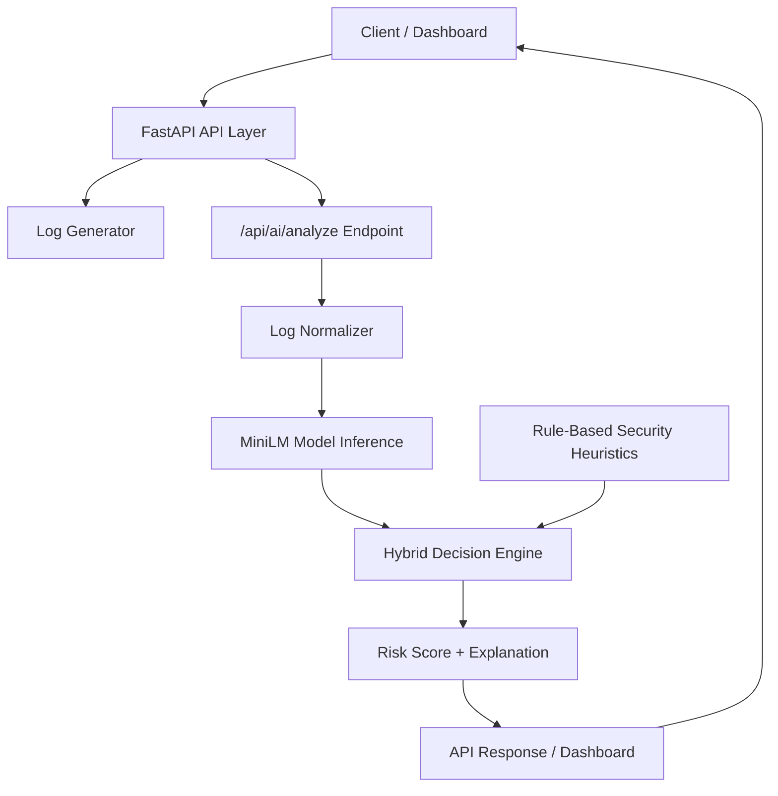
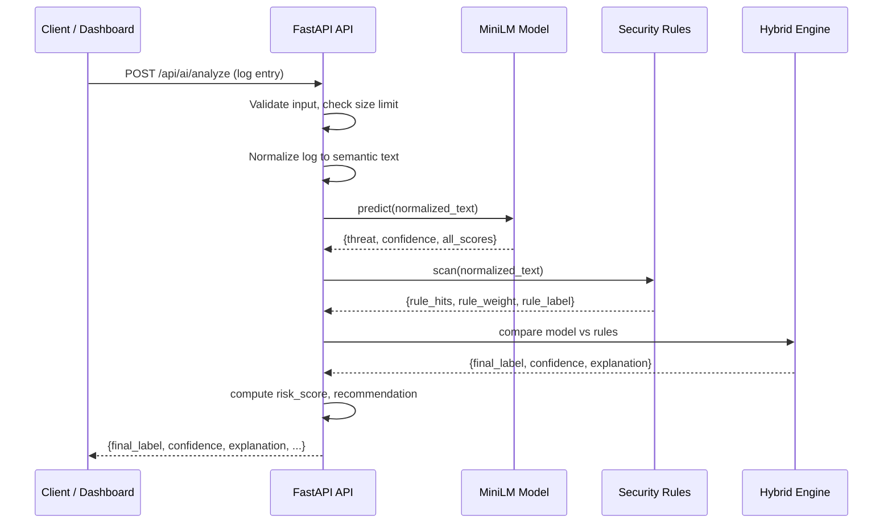

# TheKavach Architecture

## System Overview

TheKavach is a layered AI cybersecurity telemetry platform with a hybrid ML + rule-based threat detection engine.

## High-Level Architecture

## Request Flow (Sequence Diagram)

## Layer Details

| Layer | Responsibility | Technology |
|-------|---------------|------------|
| Client | Browser UI, API consumers | HTML + TailwindCSS / curl |
| API | REST endpoints, SSE streaming, auth | FastAPI |
| Log Generator | Synthetic log generation | Python (randomized) |
| Normalizer | Convert raw logs to semantic text | LogNormalizer class |
| ML Inference | Text classification pipeline | HuggingFace MiniLM |
| Rule Engine | Pattern-based threat heuristics | Regex rules (100+) |
| Hybrid Decision | Merge ML + rules, explain | HybridDetector class |
| Risk Scoring | Numeric risk (0-100) | Category-based ranges |

## Key Design Decisions

1. **Hybrid approach**: Rule-based fallback compensates for ML class imbalance without retraining.
2. **No retraining required**: All malicious detection improvements come from the rule layer.
3. **Configurable thresholds**: All thresholds are environment-driven (see `.env.example`).
4. **Backward compatibility**: Old API fields are preserved; new fields are additive.
5. **Lightweight evaluation**: `scripts/evaluate_hybrid.py` runs on CPU without GPU/training dependencies.
